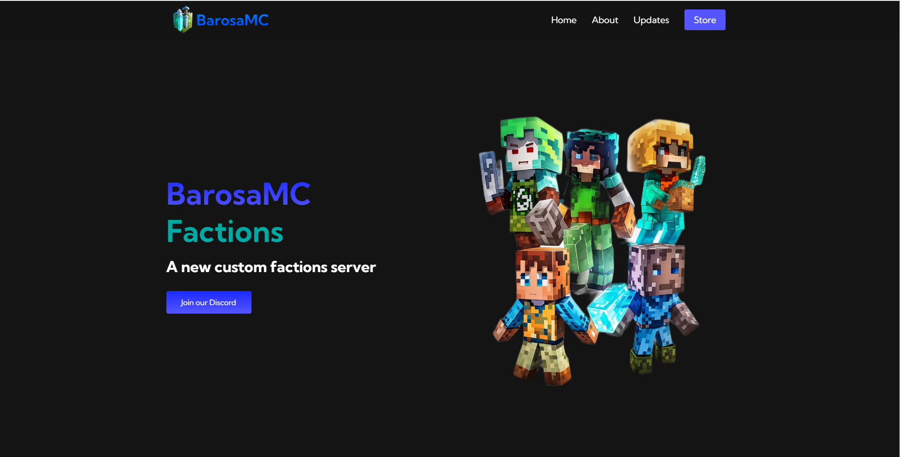
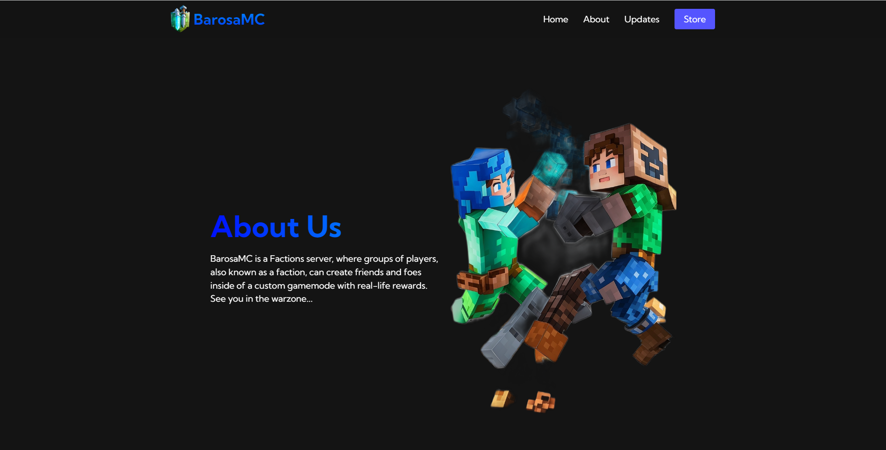
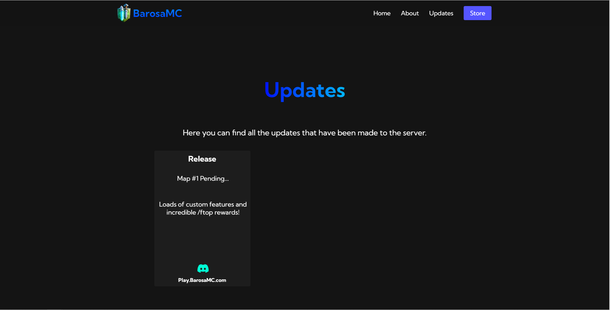

# BarosaMC
This repository contains the code for the BarosaMC website. The website consists of the following pages:

- index.html: The home page of the BarosaMC website.
- about.html: The about page providing information about BarosaMC.
- updates.html: The updates page displaying the latest updates made to the server.
## Technologies Used
The website is built using the following technologies:

- HTML
- CSS
- JavaScript
## Usage
To run the website locally, follow these steps:

1. Clone this repository to your local machine.
2. Open the cloned repository in a code editor.
3. Open any of the HTML files (`index.html`, `about.html`, `updates.html`) in a web browser to view the corresponding page.
Feel free to explore the code and customize it according to your needs.

## Screenshots
Here are some screenshots of the website:

  
Home Page (index.html)

    
About Page (about.html)

    
Updates Page (updates.html)

  

## License
This project is licensed under the MIT License.

## Acknowledgements
- Font Awesome - for providing icons used in the website.
- Google Fonts - for the Kumbh Sans font used in the website.
- LeonardoAI - creating all of the images used
